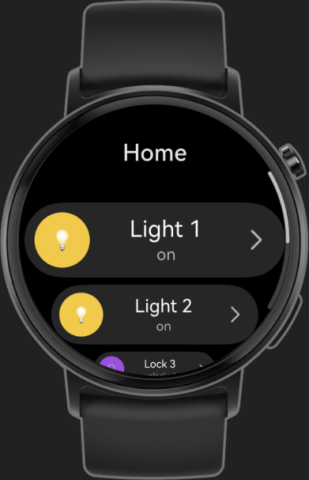
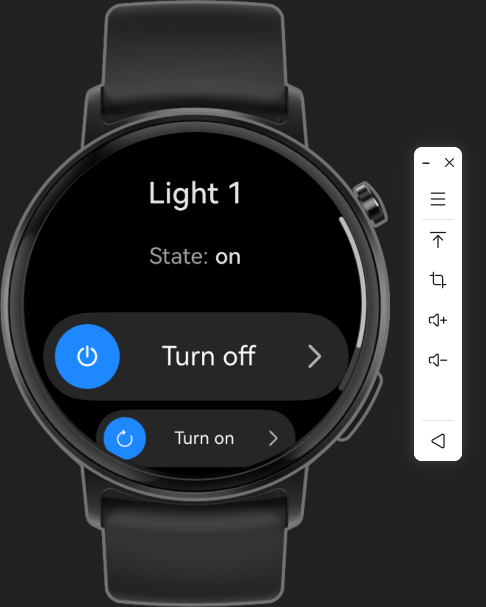
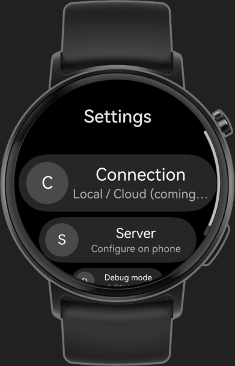

# Home Assistant for Huawei Watch on HarmonyOS Next 6.0 (Watch GT 4/5/6)

A wearable client for **Home Assistant** on Huawei watches (e.g. Watch GT 6) built with **HarmonyOS ArkTS**.
The watch app works together with an **Android phone companion** via **Wear Engine P2P messaging**.

- Home Assistant REST API: https://developers.home-assistant.io/docs/api/rest/
- Wear Engine P2P communication: https://developer.huawei.com/consumer/en/doc/harmonyos-guides/watch_p2p_communication
- Wearables UX standards: https://developer.huawei.com/consumer/en/doc/design-guides/ux-guidelines-wearable-0000002503475023

---

## Screenshots

| Index (Entities list)                | Entity details (Services Actions)                     | Settings |
|--------------------------------------|-------------------------------------------------------|---|
|  |  |  |

---

## Features

- ✅ Entity list + details screen
- ✅ Primary / secondary actions (toggle, lock/unlock, etc.)
- ✅ Round-screen UI (`ArcList`)
- ✅ Companion model: Watch ↔ Phone (P2P). Phone ↔ Home Assistant (REST)

### Supported entity domains (MVP)
- `light` (turn_on / turn_off)
- `switch` (turn_on / turn_off)
- `lock` (lock / unlock)

> The architecture is intended to be extended to other HA domains later.

---

## Tech stack

**Watch**
- HarmonyOS ArkTS + ArkUI
- `ArcList`, `ArcScrollBar`
- `AppStorageV2` state management
- Wear Engine P2P

**Phone**
- Android (Kotlin + Compose)
- Home Assistant REST API

---

## UI (round screen)

This project uses `ArcList` for natural layout on round/circular watch screens.
It looks and behaves closer to system apps than a rectangular `List` + heavy safe padding.

---

## Architecture (high level)

**Watch (ArkTS)**
- UI: `pages/Index`, `pages/EntityDetails`, `pages/Settings`
- Store: `HomeAssistantStore` (global state via `AppStorageV2`)
- Repository:
    - `P2pHomeAssistantRepository` (real mode)
    - `MockHomeAssistantRepository` (emulator mode)
- Transport: `WearEngineP2pClient` (Wear Engine P2P)

**Phone (Android / Kotlin + Compose)**
- Receives requests from watch via P2P
- Calls Home Assistant REST API
- Sends responses back to watch

---

## Project structure (watch app)

    entry/src/main/ets/
        app/ # DI / app-level services
        core/ # utils (uuid, json, etc.)
        data/
            p2p/ # WearEngine client + device resolver
            repository/ # P2P repo + Mock repo
        domain/
            model/ # EntityCard, EntityAction, messages DTO
            repository/ # HomeAssistantRepository interface
        pages/ # Index, EntityDetails, Settings
        presentation/
            store/ # HomeAssistantStore
            ui/components/ # EntityRow, etc.

---

## Requirements

- DevEco Studio
- Target API: **21**
- Watch UI: `ArcList` / `ArcScrollBar`
- A Home Assistant instance reachable from the phone (local network recommended for the initial setup)

---

## Running (watch emulator)

The watch emulator is not paired with a phone, so P2P communication is unavailable.
For development, the app automatically falls back to **Mock repository**.

1. Open the watch project in DevEco Studio.
2. Run on a Watch emulator.
3. You should see mock entities (light/lock/switch) and be able to trigger actions.

---

## Running on a real watch (with phone)

1. Install the Android companion app on the phone.
2. Pair the watch and phone (Wear Engine P2P must be available).
3. Configure Home Assistant connection on the phone:
    - base URL (local HA)
    - long-lived access token
4. Launch the watch app → it will sync entities from the phone.

---

## Extending the app

### Add new Home Assistant domain
1. Add domain → UI mapping (icon/color/labels)
2. Add supported actions → DTO messages
3. Add phone-side REST call for the new service/domain
4. Update mock repository for emulator testing

### Add remote access
The first version is focused on local network HA.
Remote mode can be added later (HA Cloud / external URL + TLS).

---

## Contributing

See [CONTRIBUTING.md](CONTRIBUTING.md).

---

## License

MIT.

